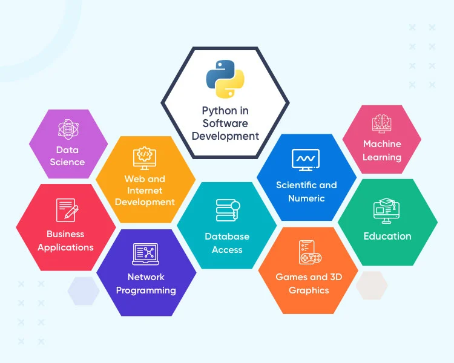
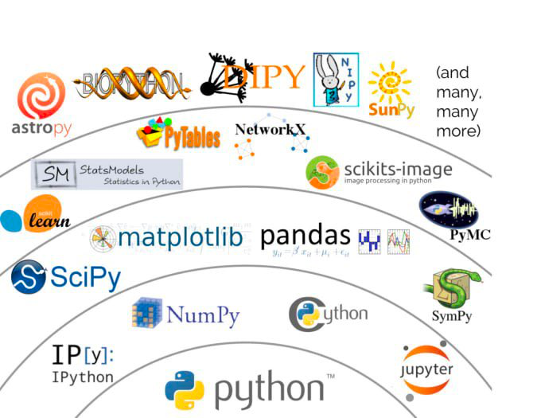

# Module 00: Course Introduction & Orientation

**Welcome to From Syntax to Data Engineering: A 60-Hour Practitioner’s Journey.**

Before we write our first line of code, we need to align on our objectives. This course is not about memorizing syntax; it is about transforming you into a highly capable software engineer who can build scalable APIs, automate complex workflows, and engineer massive datasets.

---

## 🐍 What is Python?

Python is defined as an interpreted, object-oriented, high-level programming language with dynamic semantics.

* **⚙️ Interpreted:** The source code is processed on the spot, line by line, halting immediately if an error is found (unlike compiled languages that translate everything at once).
* **📦 Object-Oriented (OOP):** It utilizes "objects" (bundling data and methods together) to make complex software easier to build, reuse, and maintain.
* **📖 High-Level:** It utilizes strong abstraction, reading much closer to natural human language than machine code.

---

## ⚖️ Pros & Cons of Python

| ✅ Advantages | ⚠️ Disadvantages |
| :--- | :--- |
| ⚡ **Rapid Development:** English-like syntax, robust libraries, and rapid prototyping capabilities. | 🐢 **Execution Speed:** As an interpreted language, it has speed limitations compared to C++. |
| 📈 **High Productivity:** Features like automatic memory management and high code readability streamline debugging. | 📱 **Mobile & UI:** Not a native language for iOS/Android, making mobile app development difficult. |
| 🌍 **Vast Ecosystem:** Open-source with massive community support and cross-platform portability. | 💾 **Resource Heavy:** High memory consumption and a lack of true multi-threading support. |

---

## 👑 The Dominance of Python in 2026

Why are we dedicating 60 hours to this specific language? Python’s true power comes from its Zen-like simplicity paired with industrial-strength capability.

* **🏆 The TIOBE Leader:** Python currently holds a record ~26% market share in programming popularity. It is the language of choice for top-tier tech companies.
* **📦 The Ecosystem:** With over 450,000 packages on PyPI, you never have to reinvent the wheel. If you have a problem, an enterprise-grade solution likely already exists.
* **💻 The Portable Code:** Write your code once on Windows, and run it on a Linux Server or a Mac without making any changes.

---

## 💼 Python Working Fields & Career Paths

  

 

Python is not just a general-purpose language; it is the backbone of the most rapidly growing tech sectors. Mastering Python opens the door to multiple high-paying career paths.

---

## 💼 Career Paths (Continued)

* **🧠 Artificial Intelligence & Generative AI (AI Engineer):** Python is the undisputed king here. From training LLMs to building autonomous agents, PyTorch and TensorFlow make Python the "operating system" for the AI revolution.
* **📊 Data Engineering & Analytics (Data Engineer/Analyst):** Modern businesses are drowning in data. Pandas and NumPy allow for high-speed manipulation of millions of rows of data, replacing complex Excel macros.
* **🌐 Backend Web Development (Backend Engineer):** Python powers the servers behind massive applications. Using frameworks like FastAPI, developers build lightning-fast RESTful APIs.

---

## 💼 Career Paths (Continued)

* **☁️ Cloud Computing & DevOps (DevOps Engineer):** Python is the glue that holds the internet together. Engineers write scripts that automate cloud infrastructure (AWS, Azure), manage Docker containers, and deploy code.
* **🛡️ Cybersecurity (Security Analyst/Penetration Tester):** Because Python allows for rapid script development, it is heavily used by security professionals to write custom network scanners, automate penetration testing, and analyze malware.

---

## 🛠️ Essential Frameworks & Tools

  

Python developers leverage ready-made components to save time:

* **🧮 Data & Math:** `NumPy`, `Pandas`, `SciPy`, and `Dask`.
* **🤖 Machine Learning:** `PyTorch` (Meta) and `TensorFlow` (Google).
* **🌐 Web Development:** `Django` (full-stack) and `FastAPI` (micro-framework).
* **📈 Visualization:** `Plotly`, `Seaborn`, and `MATLAB` engines.

---

## 🗺️ Curriculum Roadmap (Part 1)

We will build your knowledge layer by layer:

* **🧱 01. Foundations & Syntax:** Dynamic typing, variables, and how to control the flow of your programs using conditionals and loops.
* **🧩 02. Functional Programming:** Write DRY code by breaking complex problems into modular, testable, and reusable functions.
* **📦 03. Environment & Tooling:** Amateurs install packages globally; professionals use isolated workspaces (`venv` and `pip`).
* **💾 04. Data Structures & I/O:** Manage complex collections (Dictionaries, Sets) and persist your data to the hard drive using JSON.

---

## 🗺️ Curriculum Roadmap (Part 2)

* **📐 05. Object-Oriented Programming:** Architect software by modeling real-world entities using classes, inheritance, and encapsulation.
* **📊 06. Data Science Ecosystem:** Harness the power of data utilizing NumPy arrays and Pandas DataFrames for intensive data wrangling.
* **⚡ 07. Building APIs with FastAPI:** Step into web infrastructure, building high-performance RESTful APIs to serve data across the internet.
* **🎓 08. Real-World APIs & Capstone:** Fetch data from public APIs, process it, and deploy a comprehensive project that proves your capability.

---

## 🗝️ Keys to Success in this Training

 

1. **🐛 Embrace the Errors:**
   Red text in your terminal is not a failure; it is your compiler talking to you. Read the error messages carefully.
2. **💻 Practice Over Theory:**
   Reading code will not make you a programmer. You must type it out, break it, and fix it. Complete every hands-on task.
3. **🐙 Use the Repository Standards:**
   This repository uses automated Markdown linting and GitHub issues. Treat this course exactly like a professional open-source project.